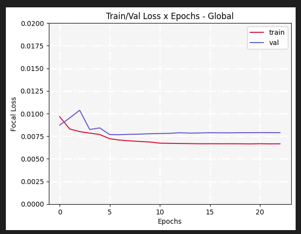
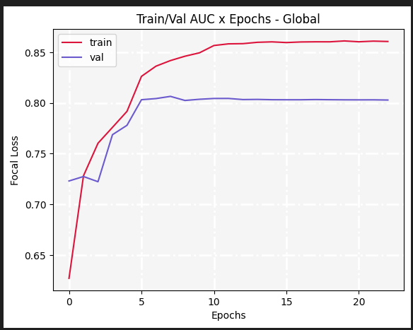
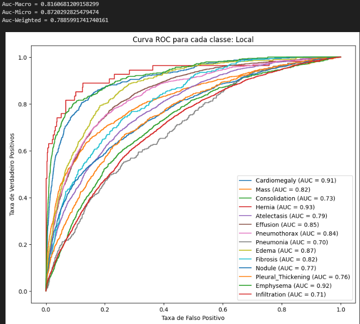

# Multi-Class Classification Problem for Chest Diseases. 

The dataset is comprised of X-Ray images of chests. The dataset is divided by patients. A patient can have more than one x-ray image.
The dataset folder contains:
* original x-ray images
* a data.csv with the info of the x-ray images
*  segmentation.csv that contains the segmentation annotation of the lungs for the chest x-rays.

  

Classes of the Dataset and the number of images:

|        Class       	| Number of Images 	|
|:------------------:	|:----------------:	|
|    Cardiomegaly    	|       2776       	|
|      Emphysema     	|       2516       	|
|      Effusion      	|       13317      	|
|       Hernia       	|        227       	|
|    Infiltration    	|       19894      	|
|        Mass        	|       5782       	|
|       Nodule       	|       6331       	|
|     Atelectasis    	|       11559      	|
|    Pneumothorax    	|       5302       	|
| Pleural Thickening 	|       3385       	|
|      Pneumonia     	|       1431       	|
|      Fibrosis      	|       1686       	|
|      Pneumonia     	|       1431       	|
|      Fibrosis      	|       1686       	|
|        Edema       	|       2303       	|
|    Consolidation   	|       4667       	|
|     No Finding     	|       60361      	|

## Model 
### Fusion Model
This model receives an image as input, it passes to two branches. The features of the two branches are passed to pointwise convolution to reduces it dimensions and are concatenated. The concatenated features are passed to an Attention.

## Results

Model Fusion Metrics:
The model was trained and evaluated in all classes except No Finding.

  

  

  

